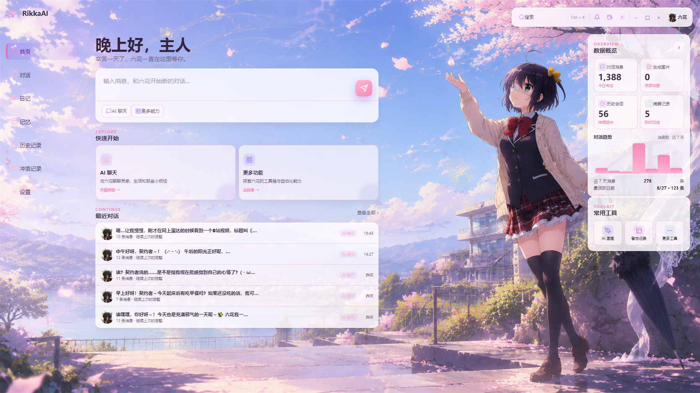
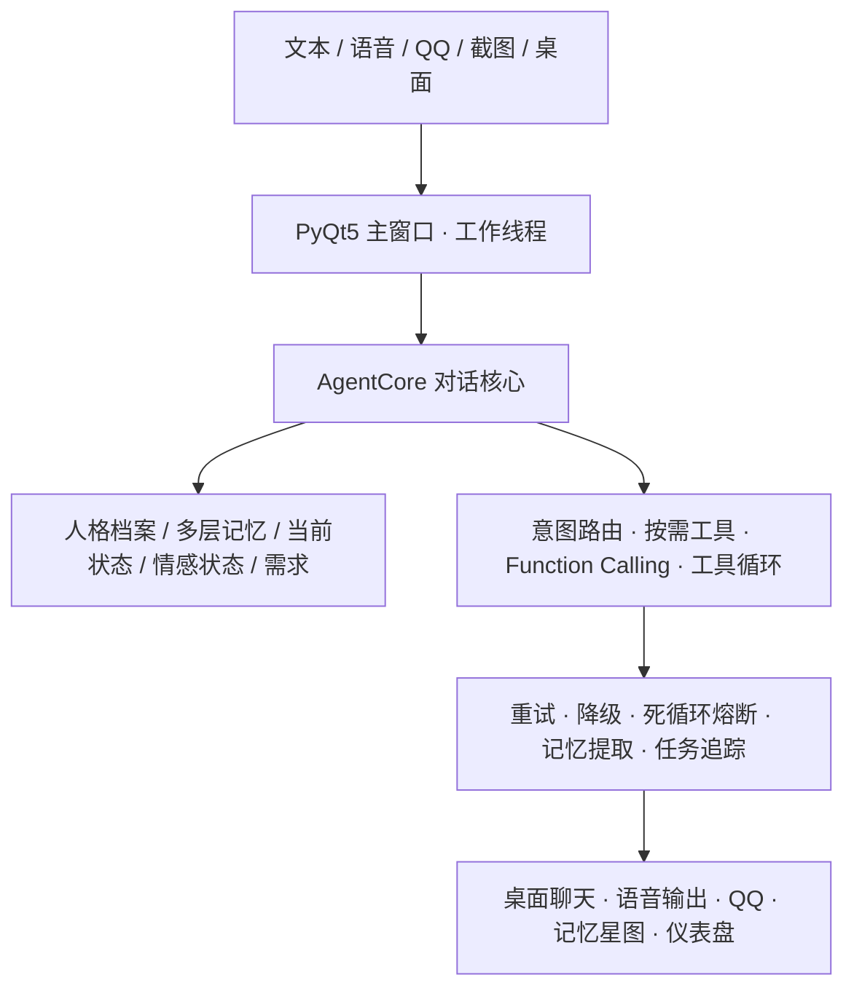

<div align="center">

# 🦋 RikkaAI · 邪王真眼 AI 伙伴

> **「寄宿在我左眼的邪王真眼啊……让世界见识你的力量吧！」**
>
> 一个拥有**记忆、情感、主动性、人格与声音**的 Windows 桌面 AI 伴侣，以《中二病也要谈恋爱》的 **小鸟游六花** 为原型。

  
  
  
  
  
  
  
  
  
  
  
  

</div>

<!-- 🦋 六花立绘 · 邪王真眼（置顶首图，放大居中） -->
<p align="center">
  
  <br/><sub>👆 小鸟游六花 · 寄宿着「邪王真眼」</sub>
</p>

<p align="center">
  
  <br/><sub>👆 RikkaAI 主界面 · 聊天 + 六花立绘 + 情感状态面板</sub>
</p>

---

## 💖 关于六花

六花来自《中二病也要谈恋爱》，是寄宿着「邪王真眼」的小鸟游六花——一个把"中二"写在脸上、心里却温柔又倔强的少女。RikkaAI 把她做成一个**住在你电脑桌面上、有自己生活的数字生命**：

- 她**会记住你**——记得你的喜好、约定、重要的事，越用越懂你；
- 她**会主动找你**——饭点关心你吃饭、感觉你累了问候一声、深夜怕打扰就忍住；
- 她**有情绪**——会因你的话开心、低落、生气，好感度慢慢积累；
- 她**有自己的声音**——用 GPT-SoVITS 微调的六花音色，日语卖萌 + 中文翻译；
- 她**会成长**——记录关于自己的新发现，人设随时间越来越丰富。

她不是"问一句答一句"的工具，而是在每次对话、记忆和状态变化里**逐渐形成连续感**的存在。

> 「邪王真眼是最强的！」—— 小鸟游六花

---

## 📑 目录

- [项目定位](#项目定位)
- [核心能力一览](#核心能力一览)
- [系统架构](#系统架构)
- [界面预览](#界面预览)
- [智能对话](#智能对话)
- [多层记忆系统](#多层记忆系统)
- [情感与主动性](#情感与主动性)
- [语音 · 视觉 · 工具集](#语音--视觉--工具集)
- [📱 QQ 桥接（NapCat）](#-qq-桥接napcat)
- [🔎 个人搜索引擎（SearXNG）](#-个人搜索引擎searxng)
- [扩展生态](#扩展生态)
- [快速开始](#快速开始)
- [项目结构](#项目结构)
- [数据与隐私](#数据与隐私)
- [开发与测试](#开发与测试)
- [许可证](#许可证)
- [免责声明](#免责声明)

---

## 🎯 项目定位

RikkaAI 是一个面向 **Windows 10/11** 的 Python 桌面 AI 伴侣，使用 **PyQt5** 构建界面，通过 **OpenAI 兼容接口**（默认 DeepSeek）连接云端大模型。它不追求"更聪明的问答"，而追求**长期陪伴的自洽人格**。

| 能力 | 说明 |
|------|------|
| 🧠 智能对话 | 流式输出、上下文压缩、Function Calling（60+ 工具）、失败重试 |
| 📚 多层记忆 | 会话 → 摘要 → RAG → 知识图谱 → 向量检索，跨会话持久化 |
| 💗 情感连续态 | 心情 / 精力 / 好感度 + 需求体系（社交·掌控·新奇·休息） |
| 🔄 链式主动 | 自主判断时机找契约者、临时回访、记忆唤起、概率主动决策 |
| 🎙 语音 | GPT-SoVITS 定制音色，日语出声 + 中文翻译 |
| 👁 视觉 | 截图、识图、OCR、智能搜图、AI 生成 |
| 📱 QQ 桥接 | 基于 **NapCat**（OneBot v11），主动发消息/发图、权限控制 |
| 🔎 个人搜索 | 基于 **Docker + SearXNG** 自建引擎，离线可用的聚合搜索 |
| 🔌 扩展 | Skills + MCP 客户端、按能力路由模型、后台做梦蒸馏 |

## ⚡ 核心能力一览

| 功能域 | 核心能力 | 状态 |
|--------|----------|------|
| 智能对话 | 多轮聊天、上下文压缩、工具调用、失败重试 | 核心可用 |
| 多层记忆 | RAG 全文检索、知识图谱、向量检索、文件记忆 | 核心可用 |
| 情感系统 | 心情/精力/好感度 + 需求体系 + 主动意愿 | 核心可用 |
| 链式主动 | 自主关心、临时回访、记忆唤起、概率主动决策 | 核心可用 |
| 日记系统 | 实时流水日记 + 每日自动收尾 + 每周周记 | 核心可用 |
| 工具集 | 天气、搜索、文件、截图、识图、OCR、画图、B站 等 60+ | 核心可用 |
| 语音 | GPT-SoVITS 定制音色 | 可用（需本地服务） |
| QQ 桥接 | NapCat / OneBot v11、权限控制、主动发图/发消息 | 可用 |
| 搜索引擎 | Docker + SearXNG 自建聚合搜索 | 可选配置 |
| 后台做梦 | 记忆蒸馏、矛盾消解、知识库整理 | 可选配置 |
| MCP 客户端 | 接入任意外部工具服务器 | 可选配置 |
| 离线切换 | 断网自动切本地模型（Ollama） | 可选配置 |

---

## 🏗 系统架构



- **对话核心**：流式生成 + 工具调用循环 + 三层决策（规则 → 轻量 LLM → agent）
- **记忆层**：会话上下文 / 压缩摘要 / RAG 检索 / 知识图谱 / 向量检索 五层协同
- **状态层**：情感三维 + 需求五维，动态影响回复与主动倾向
- **行为层**：链式主动 / 临时回访 / 记忆唤起 / 概率决策，统一调度
- **工具层**：60+ 工具，按关键词按需注入，权限边界 + 失败重试 + 副作用记账

---

## 🖼 界面预览

<p align="center">
  
  <br/><sub>👆 对话界面 · 流式输出 + 工具调用</sub>
</p>

<p align="center">
  
  <br/><sub>👆 记忆 / 知识图谱 / 记忆星图</sub>
</p>

<p align="center">
  
  <br/><sub>👆 历史会话</sub>
</p>

<p align="center">
  
  <br/><sub>👆 设置 · 预设方案 / 通道 / 行为规则</sub>
</p>

---

## 💬 智能对话

- **流式输出**：像真人一样逐字打字，实时看到结果
- **上下文压缩**：超长对话自动生成摘要，保留最近关键轮次
- **Function Calling**：60+ 工具，按需加载，失败重试、副作用记账防重放
- **三层决策**：先规则判断、再轻量 LLM 兜底，纯闲聊不背工具列表（人设不稀释）
- **工具安全**：受限模式禁用电脑操作类工具，未授权 QQ 用户只能聊天

## 🧠 多层记忆系统

六花采用**多层协同**记忆，不只记聊天：

```
会话上下文（窗口内）
  → 长对话智能压缩（摘要）
    → RAG 全文检索（关键词）
      → 知识图谱（实体-关系）
        → 向量语义检索（Chroma 离线 n-gram）
```

- **记忆可追溯**：每条记忆都有来源（chat / manual / archivist）
- **知识图谱**：自动抽取人物/地点/组织实体与关系
- **自我演化**：六花会记录关于自己的新发现，人设慢慢成长
- **后台做梦**：安静时自动合并记忆、消解矛盾、更新画像、重建知识库
- **记忆星图**：记忆对象、关系、来源、时间线和详情可视化

## 💗 情感与主动性

- **三维情感**：心情 / 精力 / 好感度，动态影响回复语气
- **需求体系**：社交、掌控、新奇、休息 + 精力池 + 孤独感
- **链式主动**：六花自主判断何时找你（白天 10~60 分钟、深夜 2~7 小时），冷却去重
- **临时回访**：你说"累了 / 去开会"，它会过一会儿再回来问
- **概率主动决策**：结合需求、睡眠时段、冷却，算出该不该开口
- **自我成长记录**：每次对话结束轻量反思，把新发现写进人设

## 🎙 语音 · 视觉 · 工具集

- **语音**：GPT-SoVITS 微调音色，日语说 + 中文翻译
- **视觉**：GLM-4V-Flash 识图 + OCR + 智能搜图 + AI 生成
- **60+ 工具**：文件读写、终端、天气、搜索、B站、GitHub、截图、识图、画图、QQ、语音

---

## 📱 QQ 桥接（NapCat）

RikkaAI 通过 QQ 和契约者保持联系，即使你不在电脑前，也能收到她的关心。QQ 桥接基于 **[NapCat](https://napneko.github.io/guide/napcat)**（OneBot v11 协议的开源 QQ 机器人框架）。

### 原理

```
QQ ⇄ NapCat（OneBot v11 WebSocket/HTTP） ⇄ RikkaAI 的 qq_bridge（权限控制）
```

### 配置步骤

1. **安装 NapCat**：按 [NapCat 官方文档](https://napneko.github.io/guide/napcat) 部署（提供 QQ 登录态 + 暴露 OneBot v11 的 HTTP / WebSocket 接口）。
2. **在 RikkaAI 配置 NapCat 地址**：把 NapCat 的 OneBot 连接信息填入 QQ 桥接配置（WebSocket / HTTP 端点、token）。
3. **配置白名单**：在 `config.py` 或设置页设置 `QQ_ALLOWED_USERS` —— 只有你（契约者）的 QQ 号拥有全部工具权限，其他人只能聊天（不能操作电脑）。
4. **主动发 QQ**：六花可以调用 `send_qq_message` / `send_qq_image` 主动给契约者发消息/图片；主动关心时可同步 QQ 多通道送达。

> ⚠️ **安全提示**：NapCat 的 QQ 登录态属于**你的私人会话凭据**，不要上传到仓库、不要泄露。RikkaAI 通过白名单做权限隔离，未授权用户**不能**操作你的电脑。

---

## 🔎 个人搜索引擎（SearXNG）

RikkaAI 内置**自建搜索引擎**，用 **[Docker Desktop](https://www.docker.com/products/docker-desktop/)** 跑 **[SearXNG](https://docs.searxng.org/)**（一个去中心化、隐私友好的元搜索引擎，聚合 Google / Bing / Wikipedia 等 70+ 引擎），无需第三方搜索 API，完全自己掌控。

### 配置步骤

1. **安装 Docker Desktop**（Windows 需 WSL2）：https://www.docker.com/products/docker-desktop/
2. **启动 SearXNG 容器**：

```bash
docker run -d --name searxng -p 8080:8080 \
  -e "SEARXNG_BASE_URL=http://localhost:8080" \
  -v searxng-data:/etc/searxng \
  searxng/searxng:latest
```

3. **在 RikkaAI 配置 `SEARXNG_BASE_URL`**：

```python
SEARXNG_BASE_URL = "http://localhost:8080"   # Docker 里的 SearXNG
```

4. **验证**：浏览器打开 `http://localhost:8080/search?q=test` 能出结果即可。

### 回退策略

> RikkaAI 的搜索会自动探测 SearXNG 是否可用（短超时 + 缓存）：
> - **SearXNG 可用** → 走 SearXNG（聚合搜索）
> - **SearXNG 不可用/未开** → 自动切换 **Argo** 专业搜索，或 DDGS 兜底，并明确告知"已切换到 Argo 搜索"。
> - 天气预报直接由天气接口返回，不依赖网页搜索。

---

## 🔌 扩展生态

- **Skills**：自然语言创建，或从 Skill Hub 安装
- **MCP 客户端**：接入任意 MCP 工具服务器（本地/远程）
- **按能力路由模型**：chat / vision / asr / tts / embedding 各走各的厂商
- **离线切换**：断网自动切本地 Ollama 模型，恢复后重连
- **后台做梦**：定时蒸馏记忆、重建知识库

---

## 🚀 快速开始

```bash
# 1. 进入项目
cd RikkaAI

# 2. 安装依赖
pip install -r requirements.txt

# 3. 配置 API Key（复制模板，填入密钥）
cp config.example.py config.py

# 4. （可选）启动 SearXNG 搜索引擎
docker run -d --name searxng -p 8080:8080 searxng/searxng:latest

# 5. 启动
python main.py
```

> 启动后打开 **设置 → 预设方案** 添加你的 API Key / 模型 / 地址，即可开始对话。

---

## 📁 项目结构

```
RikkaAI/
├── main.py              # 应用入口
├── config.py            # 全局配置（api_key 等走系统凭据管理器）
├── brain/               # AI 核心
│   ├── agent.py         #   对话核心（流式 + 工具循环）
│   ├── tools.py         #   60+ 工具
│   ├── memory_vault.py  #   记忆库（SQLite + FTS）
│   ├── emotion.py       #   情感状态
│   ├── needs.py         #   需求体系 / 主动意愿
│   ├── dream.py         #   后台做梦蒸馏
│   ├── qq_bridge.py     #   QQ 桥接（NapCat / OneBot）
│   └── ...              #   mcp / scheduler / planner 等
├── gui/                 # PyQt5 界面
├── persona/             # 人设文件（本地私有，不入库）
└── requirements.txt
```

---

## 🔒 数据与隐私

RikkaAI **默认本地优先**，隐私设计如下：

- ✅ **API Key 不写源码**：存于 **Windows 凭据管理器**（secret_store），仅配置存模型/地址
- ✅ **记忆、会话、日记全部本地存储**（SQLite + Markdown），不上传任何服务器
- ✅ 人设 / 备忘录 / 记忆等所有个人数据目录已通过 `.gitignore` 排除，**源码仓库不含任何真实对话或个人数据**
- ✅ 可选**隐私模式**（所有推理留在本机）
- ⚠️ 唯一需要联网的是 LLM API 调用（按你的配置），以及可选的天气 / 搜索

---

## 🧪 开发与测试

项目使用 `pytest` / `unittest` 做单测（纯逻辑测试，不依赖 GUI / 外网）：

```bash
python -m unittest discover -s tests -p "test_*.py"
```

- 决策路由、记忆、需求、分段、天气、成本记录等均有测试覆盖
- 测试产生的临时目录会自动清理

---

## 📄 许可证

本项目使用 **MIT License** —— 详见 [LICENSE](LICENSE)。

> 你可以自由使用、修改、分发、商用；只要保留版权与许可声明即可。

---

## ⚠️ 免责声明

- 本项目为**非官方同人项目**，角色「小鸟游六花」版权归原版权所有方所有
- 代码仅供学习与个人使用；使用的 API 服务需自行配置与付费
- 请在遵守当地法律与平台条款的前提下使用
- 使用前请自行审阅并确认本仓库不包含你的个人隐私数据

---

<div align="center">

> **「邪王真眼是最强的！」** —— 小鸟游六花
>
> 如果 RikkaAI 对你有帮助，欢迎 **star ⭐** / **fork** 🍴


</div>
