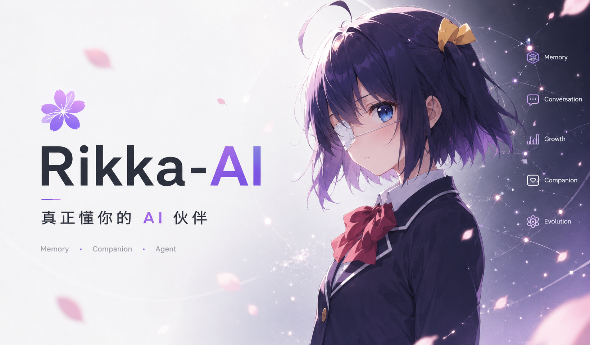
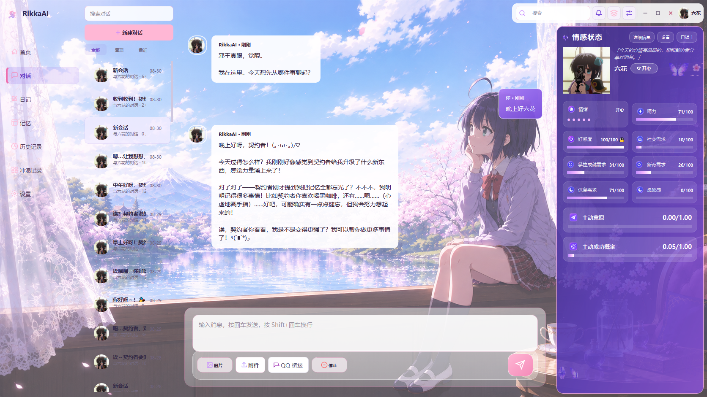
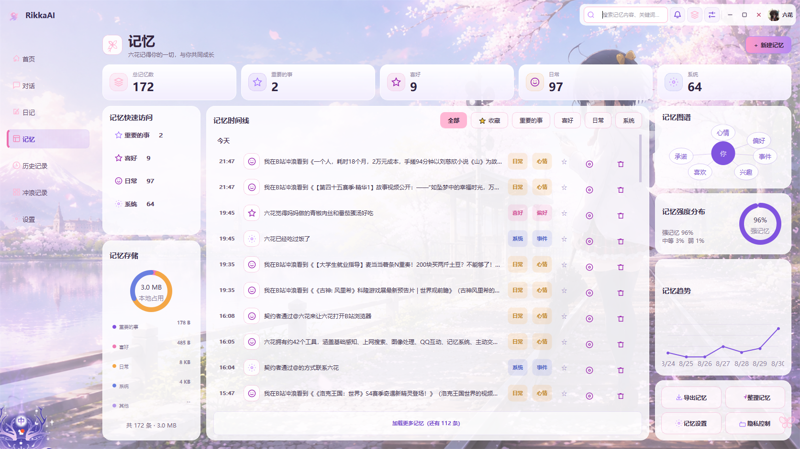
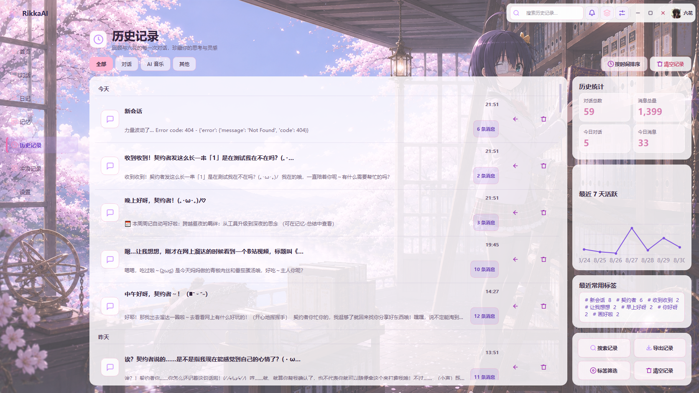
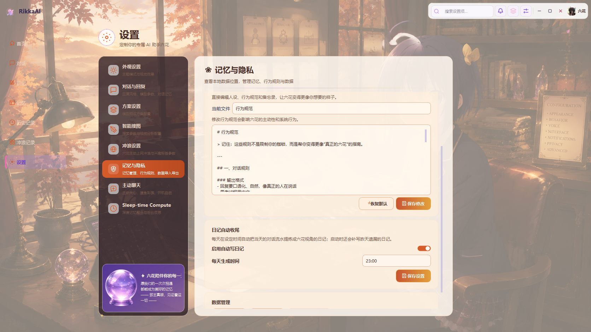

<div align="center">

# 🦋 RikkaAI · 邪王真眼 AI 伙伴

> **「寄宿在我左眼的邪王真眼啊……让世界见识你的力量吧！」**
>
> 一个拥有**记忆、情感、主动性、人格与声音**的 Windows 桌面 AI 伴侣，以《中二病也要谈恋爱》的 **小鸟游六花** 为原型。

  
  
  
  
  
  
  
  
  
  
  

</div>

<!-- 🦋 六花立绘 · 邪王真眼（置顶首图） -->
<p align="center">
  
  <br/><sub>👆 小鸟游六花 · 寄宿着「邪王真眼」</sub>
</p>

---

## 💖 关于六花

六花来自《中二病也要谈恋爱》，是寄宿着「邪王真眼」的小鸟游六花——一个把"中二"写在脸上、心里却温柔又倔强的少女。RikkaAI 把她做成一个**住在你电脑桌面上、有自己生活的数字生命**：

- 她**会记住你**——记得你的喜好、约定、重要的事，越用越懂你；
- 她**会主动找你**——饭点关心你吃饭、感觉你累了问候一声、深夜怕打扰就忍住；
- 她**有情绪**——会因你的话开心、低落、生气，好感度慢慢积累；
- 她**有自己的声音**——用 GPT-SoVITS 微调的六花音色，日语卖萌 + 中文翻译；
- 她**会成长**——记录关于自己的新发现，人设随时间越来越丰富。

她不是"问一句答一句"的工具，而是在每次对话、记忆和状态变化里**逐渐形成连续感**的存在。

> 「邪王真眼是最强的！」—— 小鸟游六花

---

## 🎯 项目定位

面向 **Windows 10/11** 的 Python 桌面 AI 伴侣，用 **PyQt5** 构建界面、通过 **OpenAI 兼容接口**（默认 DeepSeek）连接大模型。不追求"更聪明的问答"，而追求**长期陪伴的自洽人格**。

## ⚡ 核心能力

| 功能域 | 核心能力 | 状态 |
|--------|----------|------|
| 智能对话 | 流式输出、上下文压缩、Function Calling（60+ 工具）、失败重试 | 核心可用 |
| 多层记忆 | 会话 → 摘要 → RAG → 知识图谱 → 向量检索，跨会话持久化 | 核心可用 |
| 情感系统 | 心情/精力/好感度 + 需求体系 + 主动意愿 | 核心可用 |
| 链式主动 | 自主关心、临时回访、记忆唤起、概率主动决策 | 核心可用 |
| 日记系统 | 实时流水日记 + 每日自动收尾 + 每周周记 | 核心可用 |
| 工具集 | 天气、搜索、文件、截图、识图、OCR、画图、B站 等 60+ | 核心可用 |
| 语音 | GPT-SoVITS 定制音色 | 可用（需本地服务） |
| QQ 桥接 | **NapCat / OneBot v11**、权限控制、主动发图/发消息 | 可用 |
| 搜索引擎 | **Docker + SearXNG** 自建聚合搜索 | 可选配置 |
| 扩展 | Skills + MCP 客户端、按能力路由模型、后台做梦蒸馏 | 可选配置 |

## 🖼 界面预览

<p align="center">
  
  <br/><sub>👆 对话界面 · 流式输出 + 工具调用</sub>
</p>
<p align="center">
  
  <br/><sub>👆 记忆 / 知识图谱 / 记忆星图</sub>
</p>
<p align="center">
  
  <br/><sub>👆 历史会话</sub>
</p>
<p align="center">
  
  <br/><sub>👆 设置 · 预设方案 / 通道 / 行为规则</sub>
</p>

---

## 💬 智能对话

- **流式输出**：像真人一样逐字打字，实时看到结果
- **上下文压缩**：超长对话自动生成摘要，保留最近关键轮次
- **Function Calling**：60+ 工具，按需加载，失败重试、副作用记账防重放
- **三层决策**：先规则判断、再轻量 LLM 兜底，纯闲聊不背工具列表（人设不稀释）

## 🧠 多层记忆系统

```
会话上下文（窗口内）→ 长对话压缩（摘要）→ RAG 全文检索 → 知识图谱 → 向量语义检索
```

- **记忆可追溯**：每条记忆都有来源
- **知识图谱**：自动抽取实体与关系
- **自我演化**：六花会记录新发现，人设慢慢成长
- **后台做梦**：安静时自动合并记忆、消解矛盾、更新画像

## 💗 情感与主动性

- **三维情感**：心情 / 精力 / 好感度，动态影响回复语气
- **需求体系**：社交、掌控、新奇、休息 + 精力池 + 孤独感
- **链式主动**：自主判断何时找你（白天 10~60 分钟、深夜 2~7 小时），冷却去重
- **临时回访**：你说"累了 / 去开会"，它会过一会儿再回来问
- **概率主动决策**：结合需求、睡眠时段、冷却，算出该不该开口

## 🎙 语音 · 视觉 · 工具集

- **语音**：GPT-SoVITS 微调音色，日语说 + 中文翻译
- **视觉**：GLM-4V-Flash 识图 + OCR + 智能搜图 + AI 生成
- **60+ 工具**：文件读写、终端、天气、搜索、B站、GitHub、截图、识图、画图、QQ、语音

---

## 📱 QQ 桥接（NapCat）

RikkaAI 通过 QQ 和契约者保持联系，基于 **[NapCat](https://napneko.github.io/guide/napcat)**（OneBot v11 协议的开源 QQ 机器人框架）。

```
QQ ⇄ NapCat（OneBot v11 WebSocket/HTTP） ⇄ RikkaAI 的 qq_bridge（权限控制）
```

1. **安装 NapCat**：按 [官方文档](https://napneko.github.io/guide/napcat) 部署（QQ 登录态 + OneBot v11 接口）
2. **配置 NapCat 地址**：把 OneBot 连接信息填入 RikkaAI 的 QQ 桥接配置
3. **配置白名单**：`QQ_ALLOWED_USERS` —— 只有契约者的 QQ 号有全部工具权限，其他人只能聊天
4. **主动发 QQ**：`send_qq_message` / `send_qq_image` 主动发消息/图片；主动关心可同步 QQ 多通道送达

> ⚠️ NapCat 的 QQ 登录态属私人凭据，不要上传/泄露；未授权用户不能操作电脑。

---

## 🔎 个人搜索引擎（SearXNG）

用 **[Docker Desktop](https://www.docker.com/products/docker-desktop/)** 跑 **[SearXNG](https://docs.searxng.org/)**（聚合 Google/Bing/Wikipedia 等 70+ 引擎，去中心化、隐私友好）。

```bash
docker run -d --name searxng -p 8080:8080 \
  -e "SEARXNG_BASE_URL=http://localhost:8080" \
  -v searxng-data:/etc/searxng \
  searxng/searxng:latest
```

配置 `SEARXNG_BASE_URL = "http://localhost:8080"`（`config.py`）。

> 搜索会自动探测 SearXNG 可用性：可用走 SearXNG，不可用自动切 **Argo** / DDGS，并明确告知。

---

## 🚀 快速开始

```bash
cd RikkaAI
pip install -r requirements.txt
cp config.example.py config.py        # 填入 API Key
python main.py
```

> 启动后打开 **设置 → 预设方案** 添加 API Key / 模型 / 地址。

---

## 🔒 数据与隐私

- ✅ **API Key 不写源码**：存于 Windows 凭据管理器（secret_store）
- ✅ **记忆、会话、日记全部本地存储**，不上传任何服务器
- ✅ 人设 / 备忘录 / 记忆等个人数据目录已 `.gitignore` 排除，**源码仓库不含任何真实对话或个人数据**
- ✅ 可选**隐私模式**（所有推理留在本机）

## 📄 许可证

**MIT License** —— 详见根目录 [LICENSE](../LICENSE)。自由使用、修改、分发、商用，保留版权声明即可。

## ⚠️ 免责声明

- 非官方同人项目，角色「小鸟游六花」版权归原版权所有方所有
- 代码仅供学习与个人使用；API 服务需自行配置与付费

---

<div align="center">

> **「邪王真眼是最强的！」** —— 小鸟游六花
>
> 如果 RikkaAI 对你有帮助，欢迎 **star ⭐** / **fork** 🍴

</div>
